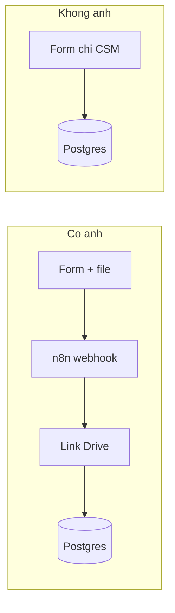
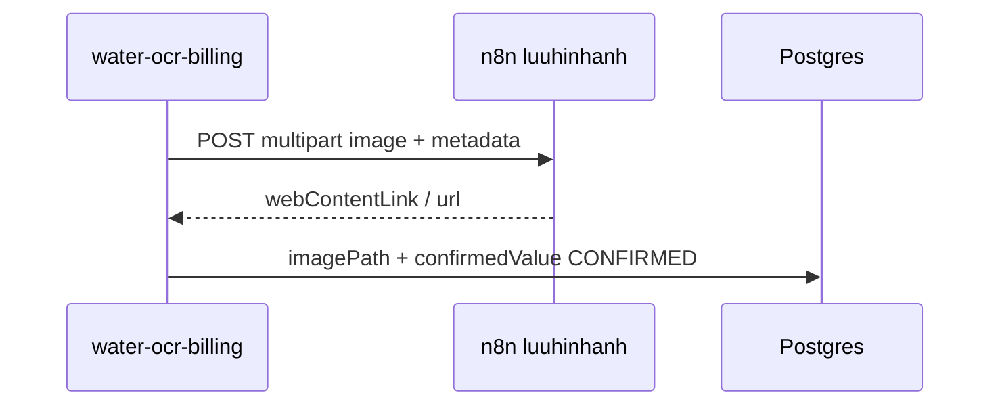

# n8n Webhook — Lưu ảnh & trả link

App gửi ảnh lên webhook n8n của bạn; workflow n8n xử lý và **trả JSON có `url`**.

**Webhook production:** https://iatzhxxuk.tino.page/webhook/luuhinhanh

---

## Luồng gửi chỉ số hộ dân (`POST /api/readings/submit`)

| Có ảnh? | Đường đi |
|---------|----------|
| **Có** | App → **n8n** → nhận `webContentLink` / `url` → ghi `imagePath` + CSM vào **DB** |
| **Không** | App → **DB** trực tiếp (không gọi n8n, không upload) |



Chi tiết có ảnh:



Code: `uploadReadingImageViaN8n()` chỉ chạy khi có buffer ảnh; `submitManualReading()` không ảnh thì bỏ qua bước n8n.

---

## 1. Cấu hình app

### Biến môi trường

| Biến | Giá trị |
|------|---------|
| `N8N_IMAGE_WEBHOOK_URL` | `https://iatzhxxuk.tino.page/webhook/luuhinhanh` (mặc định nếu không set) |

Để **tắt** webhook và dùng Blob/local: set `N8N_IMAGE_WEBHOOK_URL=` (rỗng).

Khi webhook được bật, app **không** cần `BLOB_READ_WRITE_TOKEN` cho luồng gửi ảnh hộ dân.

### Ai gọi webhook?

- Hộ dân: `POST /api/readings/submit` — **chỉ khi** form có file `image`
- API upload riêng: `POST /api/uploads/image` (MCP / tích hợp khác)

---

## 2. Payload gửi tới n8n

**Content-Type:** `multipart/form-data`

| Field | Mô tả |
|-------|--------|
| `image` | File ảnh (binary) |
| `filename` | Tên file có **thời gian**, vd `20260521_153045_reading_212001.jpg` |
| `uploaded_at` | ISO giờ VN, vd `2026-05-21T15:30:45+07:00` |
| `content_type` | MIME, vd `image/jpeg` |
| `source` | `water-ocr-billing` |
| `householdId` | ID hộ (khi gửi từ app) |
| `periodId` | ID kỳ |
| `householdCode` | MKH, vd `212001` |
| `confirmedValue` | CSM hộ nhập |

Trong n8n: dùng `$binary.image` hoặc parse `$json.body` tùy cấu hình Webhook.

---

## 3. Response bắt buộc từ n8n

Node **Respond to Webhook** trả JSON có **link ảnh** — app đọc các trường sau (ưu tiên từ trên):

- `webContentLink` — Google Drive (format bạn đang dùng)
- `webViewLink`, `url`, `imageUrl`, `downloadUrl`

**Ví dụ response Google Drive (đã hỗ trợ):**

```json
[
  {
    "webContentLink": "https://drive.google.com/uc?id=...&export=download",
    "body": {
      "confirmedValue": "142",
      "householdId": "...",
      "householdCode": "HH00001",
      "periodId": "...",
      "source": "water-ocr-billing"
    }
  }
]
```

App lưu `imagePath` = `webContentLink`.

Hoặc đơn giản: `{ "url": "https://..." }`

Nếu không có link → app báo lỗi *"n8n webhook không trả link ảnh"*.

---

## 4. Workflow mẫu

Import [`workflow-luuhinhanh.json`](./workflow-luuhinhanh.json) vào n8n (path `luuhinhanh`).

**Các bước bạn cần thêm giữa Webhook và Respond:**

1. Lưu file (`$binary.image`) lên Google Drive / S3 / Cloudinary / Vercel Blob
2. (Tùy chọn) OCR, resize, đổi tên
3. **Respond to Webhook** với `url` public

---

## 5. Test webhook (curl)

```bash
curl -X POST "https://iatzhxxuk.tino.page/webhook/luuhinhanh" \
  -F "image=@/path/to/meter.jpg" \
  -F "source=water-ocr-billing" \
  -F "householdCode=212001" \
  -F "confirmedValue=913"
```

Kết quả mong đợi: JSON có `url`.

---

## 6. API upload trực tiếp (không qua app hộ dân)

Vẫn dùng được `POST /api/uploads/image` — nếu `N8N_IMAGE_WEBHOOK_URL` bật, API cũng forward sang webhook n8n.

---

## Troubleshooting

| Triệu chứng | Xử lý |
|-------------|--------|
| Response `body: {}` | Chưa có Respond to Webhook hoặc chưa set `url` |
| HTTP 404 *not registered for POST* | Trên n8n: Webhook node phải là **POST**, workflow **Active**, path `luuhinhanh` |
| Timeout | Tăng timeout node HTTP trong app hoặc tối ưu workflow n8n |
